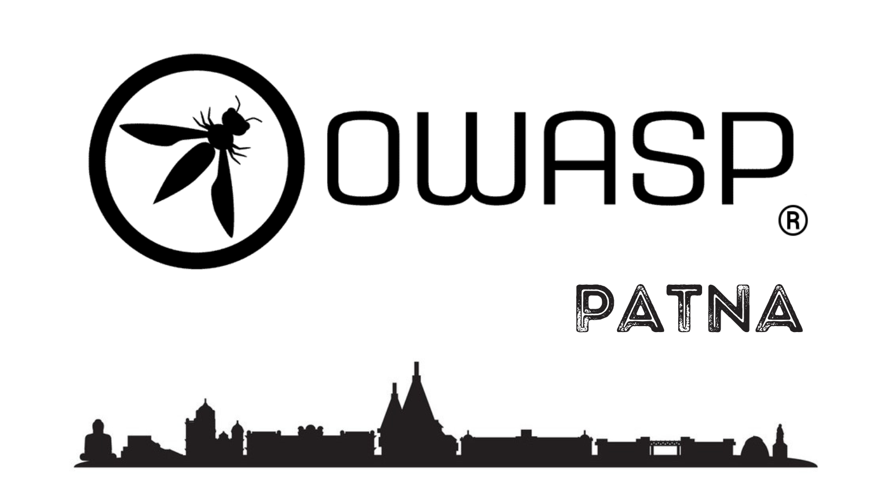

<h1> OWASP Patna</h1>

   
   

   Welcome to OWASP Patna! This chapter is built to share the knowledge regarding application security and other security stuff, on one place:)

<h1>Call for Speakers</h1>

   Call For Speakers is open - if you would like to present a talk on Application Security or any trending security topics at future OWASP Patna Chapter events - please review  and agree with the OWASP Speaker Agreement and send the proposed talk title, abstract and speaker bio to the Chapter Leaders via e-mail.

<h1>Leaders</h1>
<a href = "mailto: manas.harsh@owasp.org">Manas Harsh</a>
    
<a href = "mailto: tushar.verma@owasp.org">Tushar Verma</a>
   

<h1>Core Member</h1> 
<a href = "mailto: rs992214@gmail.com">Rahul Ramakant Singh</a>
       
<a href = "mailto: virajmota38@gmail.com">Viraj Mota</a>

      

         <h1>Volunteer Team</h1>
         

           Ankit Patel
            
            Aryabhatta
             
            Pratik Singh
           

   <h1>Links</h1>
   <a href = "https://www.meetup.com/owasp-patna/">MeetUp</a>
   

        

 14th August: On Google Meet(Virtual Meetup)         
 
   
        
      
 <hi>Upcoming Meeting:<hi> <a href = "">  
       
     
   
 
